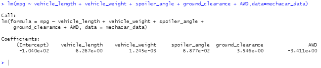
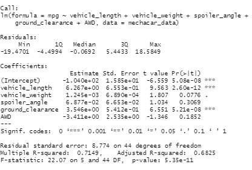
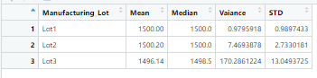
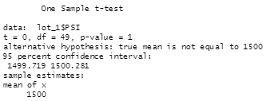
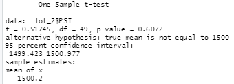
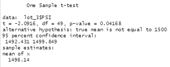

# MechaCar_Statistical_Analysis
 For this module's challenge, we used multiple linear regression analysis to detetermine which variables in our dataset predicted the mpg for MechaCar prototypes. We also analyzed summary statistics on PSI for certain manufacturing lots and their statistics compared to the population. 

## Linear Regression to Predict MPG
1.Vehicle length and ground clearance provide the non random amount of variance within this data set where the other metrics which are vehicle weight, spoiler angle and awd are not really as correlated. 

2.The p-value of 5.35-11 indicates that the slope is not 0 since it is less than the assumed signifcance level of 0.05%. Since that is the case we can state that there is sufficient evidence to reject the null hypothosis.

3. Since the r-squared in this model is 0.7149 we can confidently say that this model does predict the mpg of the prototype cares effectivly. 

## Summary Statistics on Suspension Coils
The design for the coils do meet the design specifications for all the lots if you look at the total summary dataframe with the variance right at 62.29 which is well below the 100 PSI limit. When we look at each lot individually, we see that only two lots meet the requirements of the variance well below the 100 psi range. However the only lot that didnt meet the variance threshold of 100 was lot number 3 with a variance around 170 which exceeds the 100 PSI threshold. 

## T-Tests on Suspension Coils
When we run our t test on our whole data set we get a p-value of 0.06 which is higher than the normal confidence interval of 0.05. We can state that there is not enough evidence to support the rejecting null hypothosis. 

Looking at the lots individually for lot 1, we get a p-value of 1 so we can not reject the null hypothosis. For lot 2, we get a p-value of 0.06 which is right around the pvalue we got when we ran the ttest on our dataset as a whole. Therefore, we cannot reject our null hypothosis. For lot 3, we get a pvalue of 0.041. Here the pvalue is below the significance level of 0.05.

## Study Design: MechaCar vs Competition

Key metrics that will be used in the study:
  - Cost of Mechacar vs the competitor
  - City and Highway fuel efficiency
  - Horsepower
  - Safety Rating
  - Different types of models
  - Annual expenses

Hypothosis:
Null hypothosis: Mechacar is more cost efficient vs other brands in regards to annual cost for the vehicle type.
Alternative : Mechacar is not more cost efficient vs other brands for the vehicle type.

Statisical tests:
I would do the same tests that we did in this challenge to compare vehicles. I would run regression analysis to test multiple factors and determine which factors are closely related to the annual cost of the prototype vehicles and their competitors. 
